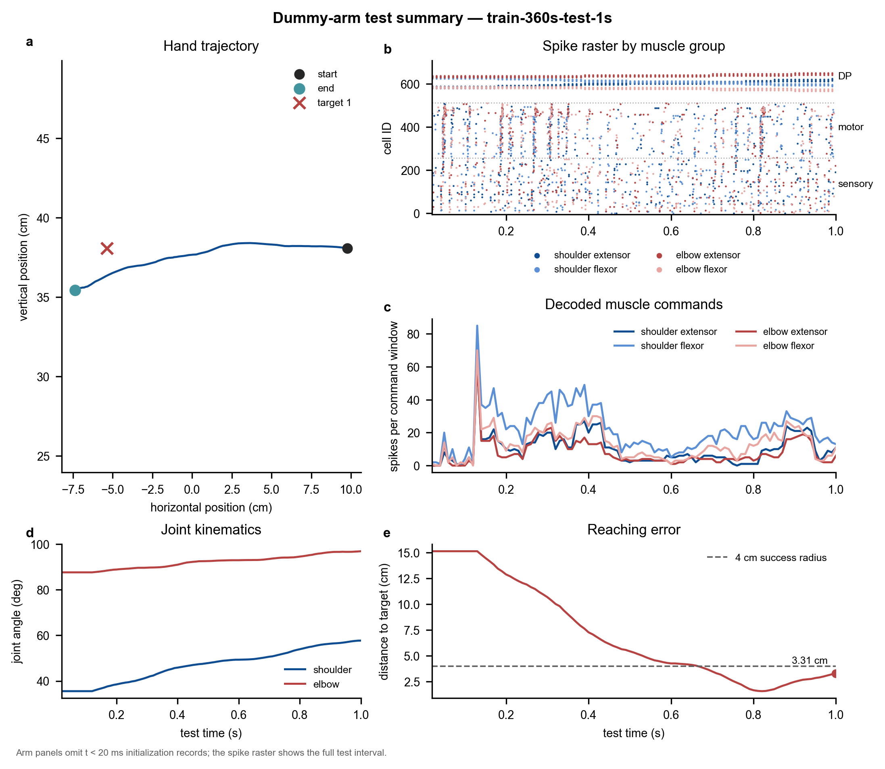
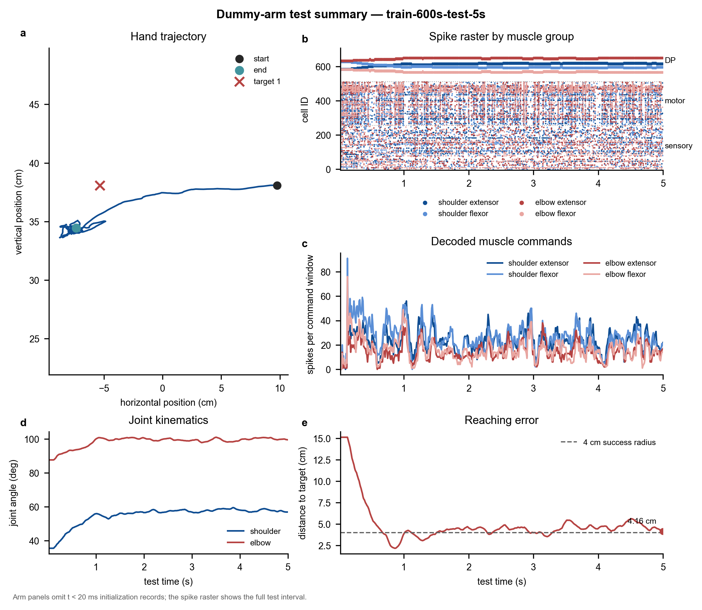

# ❗️ Warning: this branch is not ready yet. Do not use this branch for experiments. ❗️
# snn-motor-control

This repository reproduces the experiments from:

> Dura-Bernal S, Zhou X, Neymotin SA, Przekwas A, Francis JT, and
> Lytton WW (2015). *Cortical Spiking Network Interfaced with Virtual
> Musculoskeletal Arm and Robotic Arm*. Frontiers in Neurobotics, 9:13.

- Paper: [doi:10.3389/fnbot.2015.00013](https://doi.org/10.3389/fnbot.2015.00013)
- Original repository: [ModelDBRepository/183014](https://github.com/ModelDBRepository/183014)

The Python 3.12 and NEURON 8.2.6 dummy-arm workflow can currently run,
validate, plot, and animate saved results.

This branch also preserves the legacy realistic musculoskeletal-arm sources.
That backend is not currently runnable on Apple Silicon macOS and remains
separate from the validated dummy-arm workflow documented below.

## Included Results

The repository includes representative outputs under [`docs/`](docs/):

### Dummy-Arm Paper-Duration Run

This run uses the dummy arm with the paper-duration 360-second training
configuration and a 1-second test.



<video controls width="800" preload="metadata">
  <source src="docs/train-360s-test-1s/arm_motion.mp4" type="video/mp4">
  Your browser does not support embedded video. [Download the dummy-arm video](docs/train-360s-test-1s/arm_motion.mp4).
</video>

[Download the dummy-arm MP4](docs/train-360s-test-1s/arm_motion.mp4)

### 600-Second Training Run

This run uses a 600-second training override and a 5-second test.



<video controls width="800" preload="metadata">
  <source src="docs/train-600s-test-5s/arm_motion.mp4" type="video/mp4">
  Your browser does not support embedded video. [Download the 600-second-run video](docs/train-600s-test-5s/arm_motion.mp4).
</video>

[Download the 600-second-run MP4](docs/train-600s-test-5s/arm_motion.mp4)

## 1. Environment Setup

Enter the repository and activate the existing Conda environment:

```bash
cd snn-motor-control
conda activate snn
```

Confirm that commands resolve to the `snn` environment:

```bash
which python
python --version
python -c "import numpy, scipy, matplotlib, neuron; print(numpy.__version__, scipy.__version__, matplotlib.__version__, neuron.__version__)"
nrniv --version
```

Verified core versions:

- Python 3.12.13
- NumPy 1.26.4
- SciPy 1.12.0
- Matplotlib 3.8.4
- NEURON 8.2.6
- Setuptools 80.9.0

Install the recorded Python dependencies when needed:

```bash
pip install -r requirements.txt
```

The `pkg_resources is deprecated` warning printed by NEURON is expected.
Setuptools 80.9.0 is intentionally pinned because the NEURON 8.2.6 launchers
still import `pkg_resources`.

## 2. Compile the NMODL Mechanisms

Compile the mechanisms before the first simulation and after modifying any
file under `mod/`:

```bash
nrnivmodl mod
```

On Apple Silicon this creates an `arm64/` directory. NEURON 8.2.6 can wrap
the generated `special` launcher twice when `nrnivmodl` is repeatedly run
against the same output directory. For a clean rebuild, remove only the
generated architecture directory and compile once:

```bash
rm -rf arm64
nrnivmodl mod
```

## 3. Run a Short Smoke Test

Use a short headless run to verify model loading, training, testing, and output
serialization. This is a compatibility check, not a scientific experiment.

```bash
SNN_USE_NEURON_GUI=0 \
SNN_SMOKE_MS=20 \
SNN_RUN_ID=smoke-20ms \
python sim.py
```

Validate the generated data:

```bash
python validate_run.py outputs/smoke-20ms
```

The validator checks that:

- spike and arm NQS files can be loaded again;
- `mid` matches `id % 4` and all four muscle groups are present;
- trajectory, joint-angle, muscle-command, and error columns are nonempty;
- numeric fields contain no NaN or Inf values.

Each `SNN_RUN_ID` can be used only once. Existing output directories are
rejected rather than overwritten, so use a new label such as
`smoke-20ms-02` when repeating a run.

Clear the smoke-test override afterward:

```bash
unset SNN_SMOKE_MS
```

## 4. Configure Run Durations

All duration variables use milliseconds. Set `SNN_TEST_MS` to change only the
test duration. For example, run the default training followed by a 5-second
test:

```bash
SNN_USE_NEURON_GUI=0 \
SNN_TEST_MS=5000 \
SNN_RUN_ID=paper-test-5s \
python sim.py
```

Set `SNN_TRAIN_MS` to change the total training duration. For example, run
60 seconds of training followed by a 5-second test:

```bash
SNN_USE_NEURON_GUI=0 \
SNN_TRAIN_MS=60000 \
SNN_TEST_MS=5000 \
SNN_RUN_ID=train-60s-test-5s \
python sim.py
```

When an override is unset or `0`, the defaults are:

- `sim.py`: 360,000 ms of training;
- 1,000 ms of testing.

Custom training is divided into 30,000 ms epochs, preserving the original arm
reset at each epoch boundary. A 45,000 ms run therefore consists of one
30,000 ms epoch and one 15,000 ms epoch.

Duration precedence is:

- `SNN_TRAIN_MS` explicitly controls total training time;
- `SNN_TEST_MS` explicitly controls test time;
- `SNN_SMOKE_MS` supplies any unspecified duration and disables live animation.

## 5. Run the Paper-Duration Baseline

`sim.py` uses twelve 30-second epochs, for 360 seconds of simulated training,
followed by the default 1-second test. The current baseline still uses the
dummy arm.

```bash
SNN_USE_NEURON_GUI=0 \
SNN_RUN_ID=train-360s-test-1s \
python sim.py
```

Validate the run:

```bash
python validate_run.py outputs/train-360s-test-1s
```

The 360 seconds are simulation time, not a promise about wall-clock runtime.
Setting `SNN_TRAIN_MS` replaces this default.

## 6. Use the Realistic Musculoskeletal Arm

The 2015 paper uses a realistic OpenSim musculoskeletal arm. To select this
backend, set `dummyArm = 0` in `arminterface_pipe.py`, then run:

```bash
SNN_USE_NEURON_GUI=0 \
SNN_RUN_ID=real-arm-paper \
python sim.py
```

This command is currently expected to fail on Apple Silicon macOS. The
repository does not contain the `msarm/msarm` executable, the bundled shared
libraries target Linux x86-64, and the checked-in C++ sources are incomplete.

## 7. Visualize Saved Results

Generate the standard trajectory, spike-raster, muscle-command, joint-angle,
and target-error summary:

```bash
python visualize_run.py outputs/train-360s-test-1s
```

The generated files are:

```text
outputs/train-360s-test-1s/figures/summary.png
outputs/train-360s-test-1s/figures/summary.pdf
outputs/train-360s-test-1s/figures/summary.svg
```

PNG is intended for quick inspection, while SVG and PDF are suitable for
later figure preparation. The plotting commands use Matplotlib's default
backend and configuration directory; do not set `MPLBACKEND` or
`MPLCONFIGDIR` in project commands.

The dummy arm emits two initialization records at 0-10 ms before its state is
fully consistent. The arm panels therefore start at 20 ms by default. To show
the untrimmed records:

```bash
python visualize_run.py outputs/train-360s-test-1s --arm-start-ms 0
```

## 8. Render an Arm-Motion Video

Render the saved dummy-arm trajectory without rerunning training:

```bash
python animate_run.py outputs/train-360s-test-1s
```

The video is saved to:

```text
outputs/train-360s-test-1s/figures/arm_motion.mp4
```

The default video runs at 30 FPS and includes:

- the two-dimensional shoulder-elbow-hand motion;
- the target and its 4 cm success region;
- the accumulated hand trajectory;
- four synchronized muscle commands;
- synchronized target-distance error.

MP4 generation requires FFmpeg:

```bash
ffmpeg -version
```

Install it with Homebrew if necessary:

```bash
brew install ffmpeg
```

Use `--fps` to change playback speed. For example:

```bash
python animate_run.py outputs/train-360s-test-1s --fps 60
```

## 9. Output Layout

Each run uses a separate directory:

```text
outputs/<run-id>/
|-- run.json
|-- output_test-nqa.nqs
|-- output_test-spk.nqs
`-- figures/
    |-- summary.png
    |-- summary.pdf
    |-- summary.svg
    `-- arm_motion.mp4
```

`run.json` records the entry point, Python version, creation time, and relevant
environment variables. The legacy workflow currently saves only test-stage
data as `output_test-*`; training runs but is not separately serialized as
`output_train-*`.

When `SNN_RUN_ID` is omitted, the launcher creates a unique timestamped ID:

```bash
SNN_USE_NEURON_GUI=0 python sim.py
```

## 10. Use the Native NEURON GUI on macOS

The local macOS GUI does not require XQuartz. Run Python in interactive mode
so the process and native GUI remain open after the script finishes:

```bash
unset SNN_SMOKE_MS

SNN_USE_NEURON_GUI=1 \
SNN_RUN_ID=paper-gui-02 \
python -i sim.py
```

At the Python prompt, open the final trajectory window with:

```python
h.plotTraj(h.tstop, 1)
```

Replay the test-stage arm motion in a native NEURON window with:

```python
nqa = h.nqa[0]
h.animnqa(nqa, 2, int(nqa.v[0].size()) - 1, 0.03e9)
```

The starting index `2` skips the inconsistent 0-10 ms dummy-arm initialization
records. The final argument controls the per-frame delay. Press `Ctrl-D` to
leave the interactive session.

Live GUI rendering can slow the simulation and does not automatically record
a video. For reproducible, shareable output, prefer a headless run followed by
`animate_run.py`.

## 11. Run the Compatibility Tests

```bash
python -m unittest discover -s tests -v
```

## Current Realistic-Arm Limitations

- `dummyArm = 1` remains the default in `arminterface_pipe.py`.
- The required `msarm/msarm` executable is absent.
- The libraries under `msarm/lib/` are Linux x86-64 ELF binaries and cannot be
  loaded natively on Apple Silicon macOS.
- The C++ build references missing headers, build rules, and
  `LSODAIntegrator2.cpp`.
- The included videos show the two-dimensional dummy arm, not realistic muscle
  deformation or muscle force.
